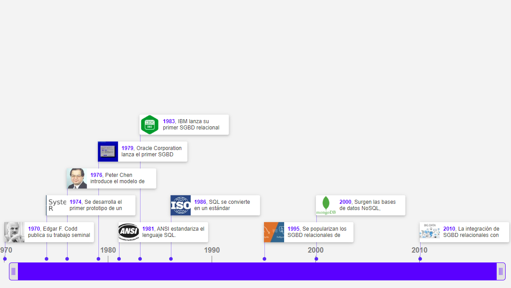

  # Informe Técnico: Bases de Datos Relacionales

  

  **Asignatura**: Programa de Especialización en Desarrollo Back-End

  **Profesor**: Roberto Pineda Lopez

  **Alumno**: Jorge Alberto Holguin Cucalon

---

# Índice

1. [Introducción](#1-introducción)
2. [Las 12 Reglas de Cood](#2-las-12-reglas-de-cood)
3. [Normalización de Bases de Datos](#3-normalización-de-bases-de-datos)
4. [El Modelo Relacional](#4-el-modelo-relacional)
5. [Linea de Tiempo: La Evolución de las Bases de Datos Relacionales](#5-línea-de-tiempo-evolución-de-las-bases-de-datos-relacionales)
6. [Conclusiones](#6-conclusiones)
7. [Referencias](#7-referencias)

---

## 1. Introducción: 

Las bases de datos relacionales son un factor esencial en la gestión y almacenamiento de información en múltiples sectores. Por ello, para brindar un mayor detalle, este informe abordará tres temas fundamentales: las 12 reglas de Codd, la normalización de las bases de datos y el modelo relacional para el modelado de bases de datos.

---

## 2. Las 12 Reglas de Cood.

Edgar F. Codd, padre del modelo relacional de bases de datos, definió 12 reglas que deben cumplirse para que un sistema de gestión de bases de datos sea considerado relacional.

1. **Regla de la información**: Todos los datos deben estar almacenados en tablas, y las tablas deben cumplir las premisas del modelo relacional.
2. **Regla del acceso garantizado**: Cualquier dato debe ser accesible mediante la combinación del nombre de la tabla, el valor de la clave primaria y el nombre de la columna.
3. **Tratamiento sistemático de valores nulos**: El sistema gestor de base de datos debe tener la capacidad de manejar valores nulos, ya que estos pueden representar datos faltantes o inaplicables que pueden dar un significado a la columna que los contiene.
4. **Catálogo dinámico en línea basado en el modelo relacional**: El sistema de gestión de bases de datos debe soportar un catálogo en línea, accesible a los usuarios autorizados, permitiendo el acceso a la estructura de la base de datos.
5. **Regla del sublenguaje completo**: Debe existir al menos un lenguaje que sea capaz de realizar todas las operaciones y funciones sobre el sistema de gestión de bases de datos, ya sea para la definición, manipulación y control de los datos.
6. **Regla de la actualización de vistas**: Las vistas generadas deben ser capaces de mostrar la información actualizada, sin diferencias entre los datos en las vistas y las tablas base.
7. **Inserción, actualización y eliminación de alto nivel**: Las operaciones DML en la base de datos deben poder manejarse en un lenguaje de alto nivel, más fácilmente comprensible para un humano.
8. **Independencia física de datos**: Los cambios en el almacenamiento físico de la base de datos no deben afectar la forma de acceso a ellos, y por ende no deberían afectar nuestras aplicaciones ni a los esquemas lógicos.
9. **Independencia lógica de datos**: Los cambios en la estructura lógica de la base de datos no deben afectar al resto de estructuras y aplicaciones existentes.
10. **Independencia de la integridad**: Las reglas de integridad deben ser especificables por el usuario y almacenadas estrictamente en el sistema de gestión de bases de datos.
11. **Independencia de distribución**: Si el sistema de gestión de bases de datos se distribuye en varios servidores, no se debe afectar su uso ni la programación de las aplicaciones del usuario.
12. **No subversión**: Si el sistema tiene una interfaz de bajo nivel, esta no debe poder ser utilizada para evadir las reglas de integridad o seguridad del sistema de gestión de bases de datos.

---

## 3. Normalización de Bases de Datos
La normalización es un proceso que organiza los datos en tablas para reducir la redundancia y mejorar la integridad de los datos. Este proceso se lleva a cabo en varias fases llamadas formas normales:

- **Primera Forma Normal (1NF)**: La cual consiste en eliminar los grupos repetitivos asegurando que cada campo contiene sólo un valor.

**Tabla No Normalizada:**
| ID | Nombre     | Teléfono          |
|----|------------|-------------------|
| 1  | Juan Pérez | 123456, 789012    |
| 2  | Ana Gómez  | 345678            |

**Tabla Normalizada (1NF):**
| ID | Nombre     | Teléfono |
|----|------------|----------|
| 1  | Juan Pérez | 123456   |
| 1  | Juan Pérez | 789012   |
| 2  | Ana Gómez  | 345678   |

- **Segunda Forma Normal (2NF)**: Asegura que cada campo no clave es completamente dependiente de la clave primaria.

**Tabla en 1NF:**
| ID_Producto | Nombre_Producto  | ID_Proveedor | Nombre_Proveedor |
|-------------|------------------|--------------|------------------|
| 1           | Producto1        | 1            | Proveedor1       |
| 2           | Producto2        | 1            | Proveedor1       |
| 3           | Producto3        | 2            | Proveedor2       |

**Tablas Normalizadas (2NF):**

- **Productos:**

| ID_Producto | Nombre_Producto  |
|-------------|------------------|
| 1           | Producto1        |
| 2           | Producto2        |
| 3           | Producto3        |

- **Proveedores:**

| ID_Proveedor | Nombre_Proveedor |
|--------------|------------------|
| 1            | Proveedor1       |
| 2            | Proveedor2       |

- **Tercera Forma Normal (3NF)**: No deben existir dependencias transitivas, es decir, no debe haber dependencias de atributos no clave con otros atributos no clave.

**Tabla en 2NF:**

| ID_Empleado | Nombre_Empleado | ID_Departamento | Nombre_Departamento |
|-------------|------------------|-----------------|---------------------|
| 1           | Juan Pérez       | 1               | Ventas              |
| 2           | Ana Gómez        | 2               | Marketing           |

**Tablas Normalizadas (3NF):**

- **Empleados:** 

| ID_Empleado | Nombre_Empleado  | ID_Departamento |
|-------------|------------------|-----------------|
| 1           | Juan Pérez       | 1               |
| 2           | Ana Gómez        | 2               |

- **Departamentos:**

| ID_Departamento | Nombre_Departamento |
|-----------------|---------------------|
| 1               | Ventas              |
| 2               | Marketing           |

- **Forma Normal de Boyce-Codd (BCNF)**
Una versión más estricta de la 3NF, donde para cada dependencia funcional X -> Y, X debe ser una superclave.

#### Ejemplo:

**Tabla en 3NF:**

| ID_Profesor | Nombre_Profesor  | ID_Curso | Nombre_Curso |
|-------------|------------------|----------|--------------|
| 1           | Prof. López      | 1        | Matemáticas  |
| 2           | Prof. Pérez      | 2        | Física       |
| 1           | Prof. López      | 2        | Física       |

**Tablas Normalizadas (BCNF):**

- **Profesores:**

| ID_Profesor | Nombre_Profesor  |
|-------------|------------------|
| 1           | Prof. López      |
| 2           | Prof. Pérez      |

- **Cursos:**

| ID_Curso | Nombre_Curso |
|----------|--------------|
| 1        | Matemáticas  |
| 2        | Física       |

- **Asignaciones:**

| ID_Profesor | ID_Curso |
|-------------|----------|
| 1           | 1        |
| 2           | 2        |
| 1           | 2        |

- **Cuarta Forma Normal (4NF)**: Elimina las dependencias multivaluadas. Estas ocurren cuando una tupla en una tabla puede estar asociada con múltiples valores de otra columna sin relación entre esos valores. La 4NF asegura que una tabla no debe tener más de una dependencia multivaluada, evitando redundancias y anomalías.

**Tabla en BCNF:**
| ID_Producto | ID_Proveedor | ID_Almacén |
|-------------|--------------|------------|
| 1           | 1            | 1          |
| 1           | 2            | 1          |
| 2           | 1            | 2          |
| 2           | 2            | 2          |

**Tablas Normalizadas (4NF):**
- **Proveedores_Producto:**

| ID_Producto | ID_Proveedor |
|-------------|--------------|
| 1           | 1            |
| 1           | 2            |
| 2           | 1            |
| 2           | 2            |

- **Almacenes_Producto:**

| ID_Producto | ID_Almacén |
|-------------|------------|
| 1           | 1          |
| 2           | 2          |

- **Quinta Forma Normal (5NF)**: Asegura que no hay dependencias de unión, en la cual una tabla puede ser dividida en dos o más tablas más pequeñas que pueden ser recombinadas sin pérdida de información.

**Tabla en 4NF:**

| ID_Proyecto | ID_Empleado | ID_Habilidad |
|-------------|-------------|--------------|
| 1           | 1           | 1            |
| 1           | 1           | 2            |
| 2           | 2           | 1            |
| 2           | 2           | 2            |

**Tablas Normalizadas (5NF):**
- **Proyectos_Empleados:**

| ID_Proyecto | ID_Empleado |
|-------------|-------------|
| 1           | 1           |
| 2           | 2           |

- **Empleados_Habilidades:**

| ID_Empleado | ID_Habilidad |
|-------------|--------------|
| 1           | 1            |
| 1           | 2            |
| 2           | 1            |
| 2           | 2            |

- **Proyectos_Habilidades:**

| ID_Proyecto | ID_Habilidad |
|-------------|--------------|
| 1           | 1            |
| 1           | 2            |
| 2           | 1            |
| 2           | 2            |

---

## 4. El Modelo Relacional
El modelo relacional es una forma de organizar los datos en tablas llamadas relaciones. Cada relación se compone de tuplas, también llamadas filas, y atributos, comúnmente denominados columnas. Las características principales del modelo relacional incluyen:

- **Tablas**: La estructura básica del modelo relacional donde se almacenan los datos.
- **Tuplas**: Las filas de las tablas, que representan una entidad única.
- **Atributos**: Las columnas de las tablas, que representan los diferentes tipos de datos.
- **Claves Primarias**: Atributos que identifican de manera única una tupla dentro de una tabla.
- **Claves Foráneas**: Atributos que establecen relaciones entre diferentes tablas.
- **Operaciones Relacionales**: Conjunto de operaciones (selección, proyección, unión, intersección, diferencia, producto cartesiano, etc.) que se pueden realizar sobre las tablas.

---

## 5. Línea de Tiempo: Evolución de las Bases de Datos Relacionales

Puedes ver una línea de tiempo interactiva con estos detalles en: [Evolución de las Bases de Datos Relacionales](https://www.timetoast.com/timelines/3083060).

---

## 6. Conclusiones

- La importancia de las reglas de Codd radica en que garantizan que las bases de datos relacionales sean robustas, consistentes y eficientes en las consultas, proporcionando un marco de desarrollo sólido para los programadores.

- La normalización de bases de datos es un paso crucial para eliminar redundancias y mejorar la integridad de los datos, siendo vital para operaciones transaccionales.

- Observando la línea de tiempo de la evolución de las bases de datos relacionales, desde la propuesta de Codd en 1970 hasta la adopción de estándares internacionales como el lenguaje SQL, podemos ver cómo el modelo relacional ha mantenido su uso extendido en diversas aplicaciones hasta el día de hoy, debido a su flexibilidad y poder para la gestión de bases de datos.

- Actualmente, los sistemas de gestión de bases de datos se han integrado con nuevas tecnologías como Big Data y Machine Learning, ampliando sus capacidades. Esto ha permitido que muchas aplicaciones puedan manejar volúmenes de datos gigantescos y realizar análisis más profundos de los datos.

- A pesar de que las bases de datos relacionales han dominado el paradigma del almacenamiento de datos durante varias décadas, la necesidad de consultar datos de manera rápida debido a aplicaciones globales como Google, Facebook y otras empresas fomentó la aparición de bases de datos NoSQL y otras tecnologías. Por ello, es preciso evaluar qué opción es más conveniente para elegir el gestor de bases de datos más adecuado.

---

## 7. Referencias
- [Las 12 + 1 leyes de Codd](https://platzi.com/tutoriales/1566-bd/4120-las-12-1-leyes-de-codd/)
- [Descripción de la normalización de bases de datos](https://learn.microsoft.com/es-es/office/troubleshoot/access/database-normalization-description)
- [Historia de las bases de datos](https://platzi.com/tutoriales/1566-fundamentos-db/5756-historia-de-las-bases-de-datos-2/#:~:text=El%20origen%20de%20las%20actuales,Unidos%20en%20el%20a%C3%B1o%201890.)
